# LINKOS UI 프리뷰

실제 프로덕션 빌드(`next build`)와 PostgreSQL에서 시드 데이터로 캡처한 화면입니다. 각 화면 아래 링크는 해당 소스 코드입니다.

> 라이브로 직접 눌러보려면 [README의 실행 방법](../README.md#로컬-실행) 또는 [배포](../README.md#배포)를 참고하세요.

## 비회원 교환 (가입 없이)

<table>
<tr>
<td width="33%" valign="top">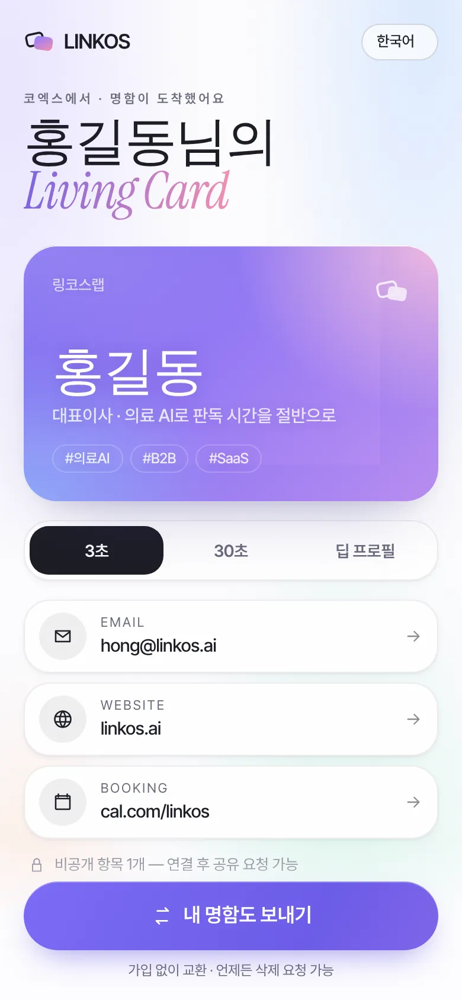 <b>① 명함 도착 — 로그인 없이 3초 카드</b> <a href="../apps/web/src/app/x/%5Btoken%5D/GuestFlow.tsx"><code>GuestFlow.tsx</code></a></td>
<td width="33%" valign="top">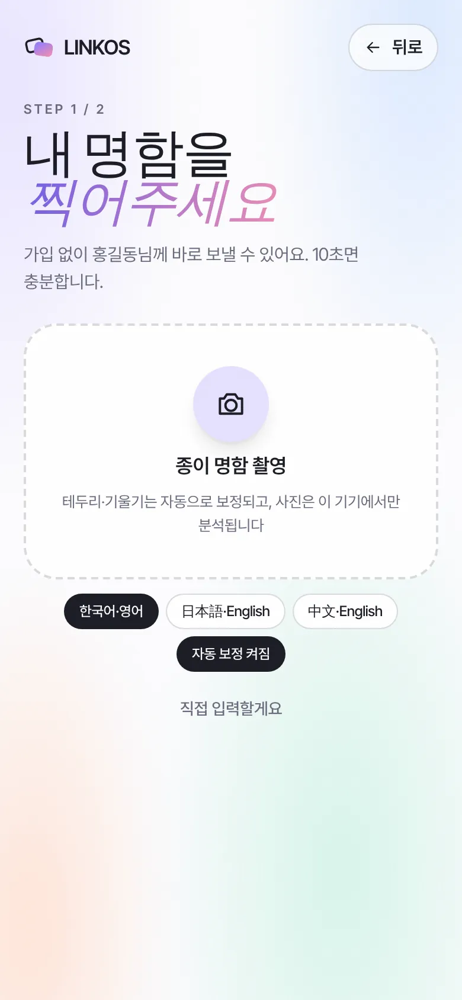 <b>② 내 종이 명함 촬영 (기기 내 OCR)</b> <a href="../apps/web/src/components/CardScanner.tsx"><code>CardScanner.tsx</code></a></td>
<td width="33%" valign="top">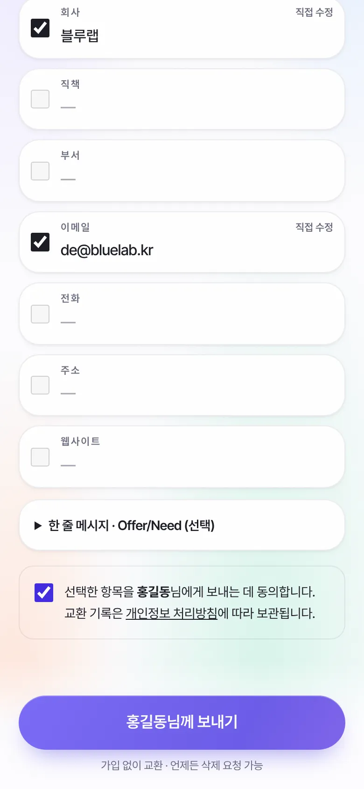 <b>③ 보낼 항목 선택 + 동의</b> <a href="../apps/web/src/components/ReviewFields.tsx"><code>ReviewFields.tsx</code></a></td>
</tr>
<tr>
<td width="33%" valign="top"> <b>④ 교환 완료 → 그 다음에 Claim</b> <a href="../apps/web/src/app/x/%5Btoken%5D/GuestFlow.tsx"><code>GuestFlow.tsx</code></a></td>
<td width="33%" valign="top">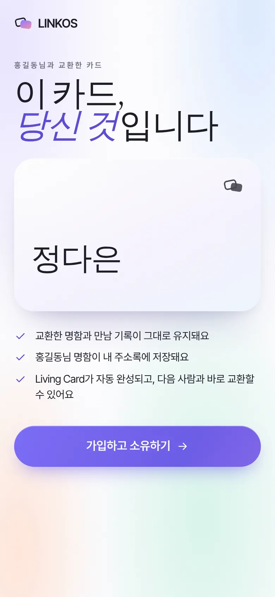 <b>⑤ 내 카드 소유하기 (Claim)</b> <a href="../apps/web/src/app/claim/ClaimFlow.tsx"><code>ClaimFlow.tsx</code></a></td>
<td width="33%" valign="top">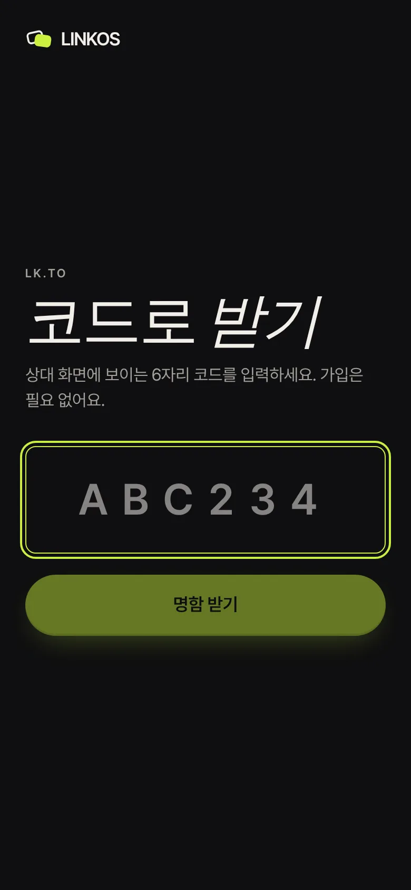 <b>단축코드로 받기</b> <a href="../apps/web/src/app/c/page.tsx"><code>page.tsx</code></a></td>
</tr>
</table>

## 교환 (보내는 사람)

<table>
<tr>
<td width="33%" valign="top">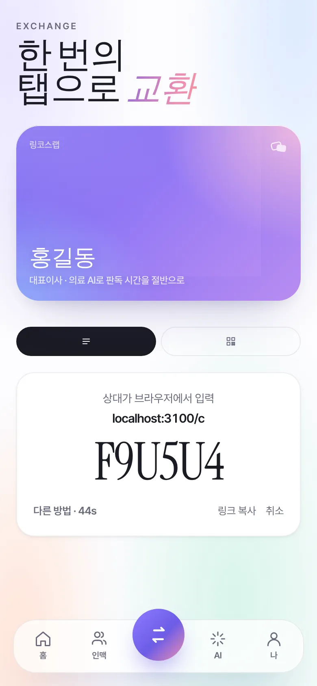 <b>공유 → 단축코드 (실시간 수신 상태)</b> <a href="../apps/web/src/app/app/exchange/ExchangeConsole.tsx"><code>ExchangeConsole.tsx</code></a></td>
<td width="33%" valign="top"> <b>QR은 최종 폴백으로 자동 표시</b> <a href="../packages/domain/src/handoff.ts"><code>handoff.ts</code></a></td>
<td width="33%" valign="top">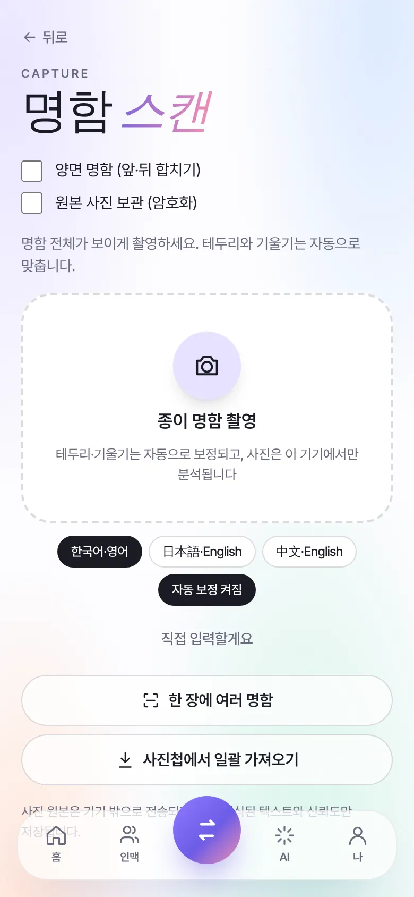 <b>명함 스캔 (앞·뒤면, 4개 언어)</b> <a href="../apps/web/src/app/app/scan/ScanFlow.tsx"><code>ScanFlow.tsx</code></a></td>
</tr>
</table>

## 앱 화면

<table>
<tr>
<td width="33%" valign="top">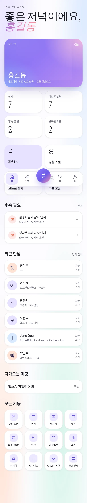 <b>홈 — 오늘의 후속·최근 만남</b> <a href="../apps/web/src/app/app/page.tsx"><code>page.tsx</code></a></td>
<td width="33%" valign="top">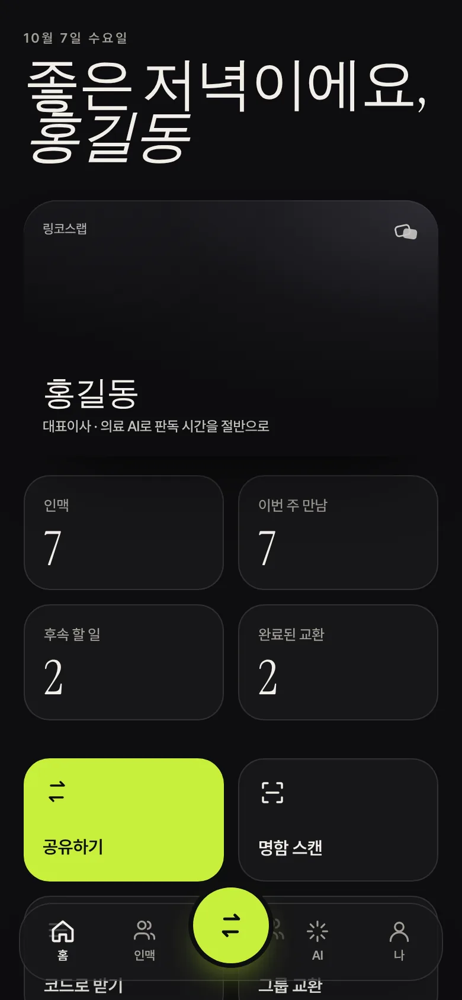 <b>홈 (다크 모드)</b> <a href="../apps/web/src/app/globals.css"><code>globals.css</code></a></td>
<td width="33%" valign="top">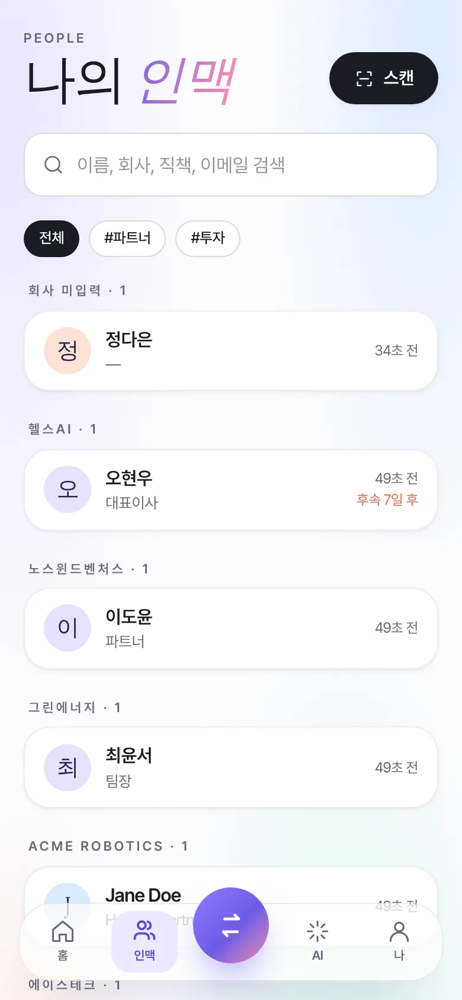 <b>인맥 — 회사별 그룹·검색·태그</b> <a href="../apps/web/src/app/app/people/PeopleList.tsx"><code>PeopleList.tsx</code></a></td>
</tr>
<tr>
<td width="33%" valign="top">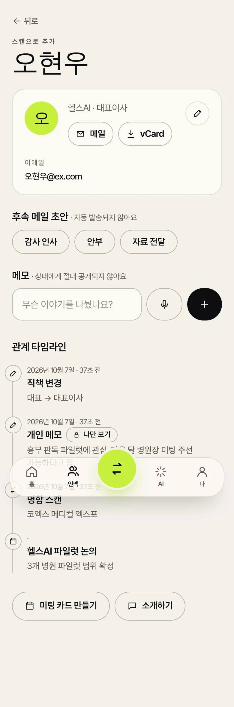 <b>인맥 상세 — 타임라인·메모·음성·메일 초안·변경 이력</b> <a href="../apps/web/src/app/app/people/%5Bid%5D/PersonDetail.tsx"><code>PersonDetail.tsx</code></a></td>
<td width="33%" valign="top">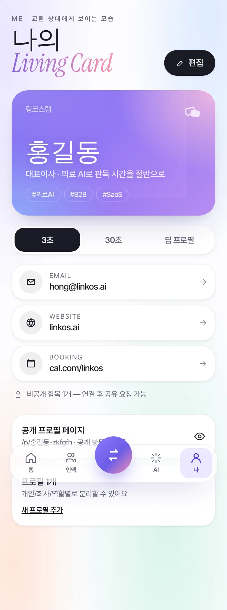 <b>내 Living Card (3초/30초/딥)</b> <a href="../apps/web/src/components/LivingCard.tsx"><code>LivingCard.tsx</code></a></td>
<td width="33%" valign="top">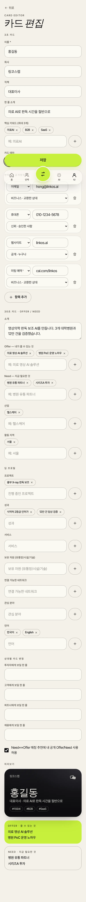 <b>카드 편집 — 공개범위·Offer/Need·변형</b> <a href="../apps/web/src/app/app/me/edit/CardEditor.tsx"><code>CardEditor.tsx</code></a></td>
</tr>
<tr>
<td width="33%" valign="top"> <b>AI 관계 기억 검색 (근거 표시)</b> <a href="../services/api/src/modules/ai.ts"><code>ai.ts</code></a></td>
<td width="33%" valign="top">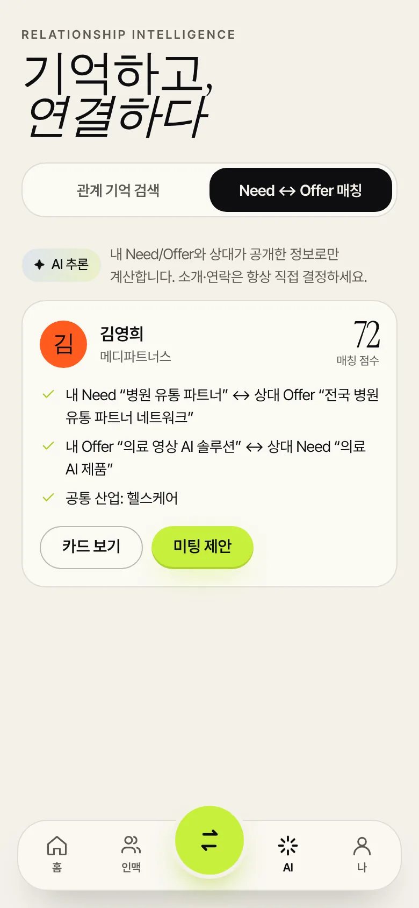 <b>Need ↔ Offer 매칭 (설명 가능)</b> <a href="../packages/domain/src/match.ts"><code>match.ts</code></a></td>
<td width="33%" valign="top">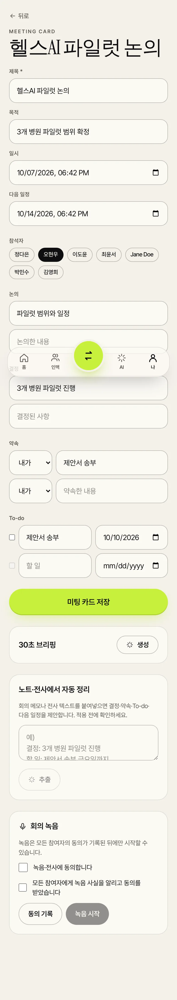 <b>Meeting Card — 결정·약속·To-do·브리핑·녹음 동의</b> <a href="../apps/web/src/app/app/meetings/MeetingEditor.tsx"><code>MeetingEditor.tsx</code></a></td>
</tr>
<tr>
<td width="33%" valign="top">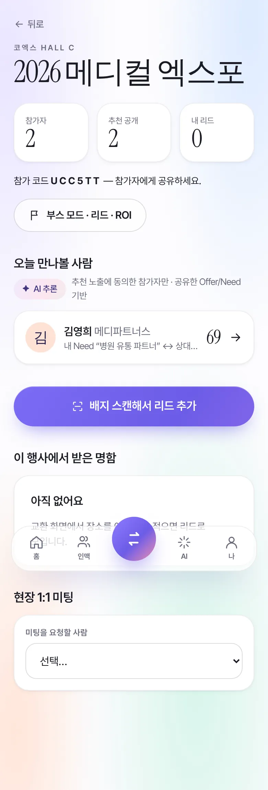 <b>행사 — opt-in 추천·리드</b> <a href="../apps/web/src/app/app/events/%5Bid%5D/EventDetail.tsx"><code>EventDetail.tsx</code></a></td>
<td width="33%" valign="top">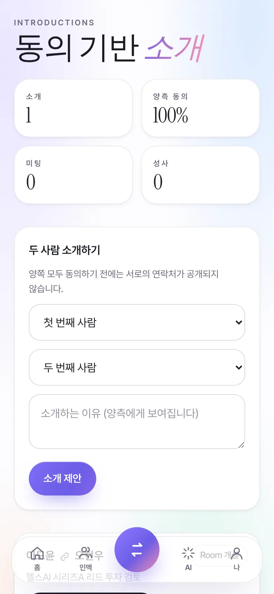 <b>동의 기반 소개</b> <a href="../apps/web/src/app/app/intros/IntrosHub.tsx"><code>IntrosHub.tsx</code></a></td>
<td width="33%" valign="top">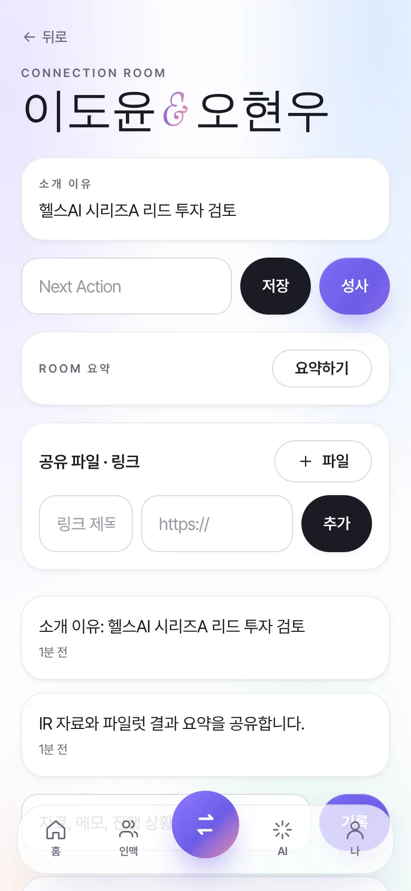 <b>Connection Room</b> <a href="../apps/web/src/app/app/rooms/%5Bid%5D/Room.tsx"><code>Room.tsx</code></a></td>
</tr>
<tr>
<td width="33%" valign="top">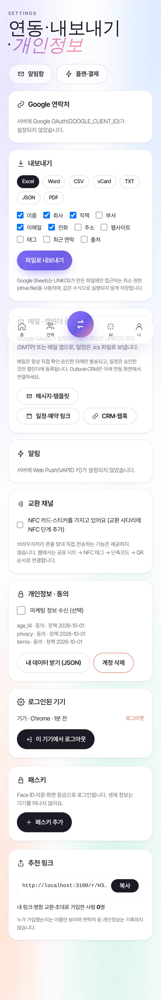 <b>Google 연락처·Sheets·내보내기·개인정보</b> <a href="../apps/web/src/app/app/settings/Settings.tsx"><code>Settings.tsx</code></a></td>
<td width="33%" valign="top">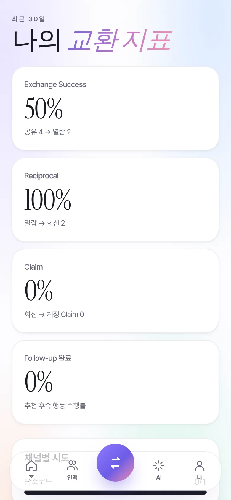 <b>교환 KPI</b> <a href="../apps/web/src/app/app/insights/page.tsx"><code>page.tsx</code></a></td>
</tr>
</table>

## 공개 페이지

<table>
<tr>
<td width="33%" valign="top"> <b>랜딩 (모바일)</b> <a href="../apps/web/src/app/page.tsx"><code>page.tsx</code></a></td>
<td width="33%" valign="top">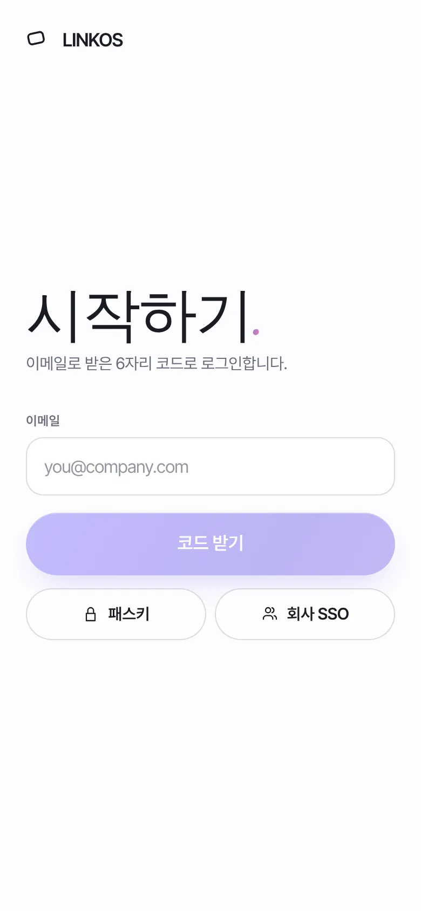 <b>로그인 — 이메일 OTP·Google·동의 분리</b> <a href="../apps/web/src/app/login/LoginForm.tsx"><code>LoginForm.tsx</code></a></td>
<td width="33%" valign="top">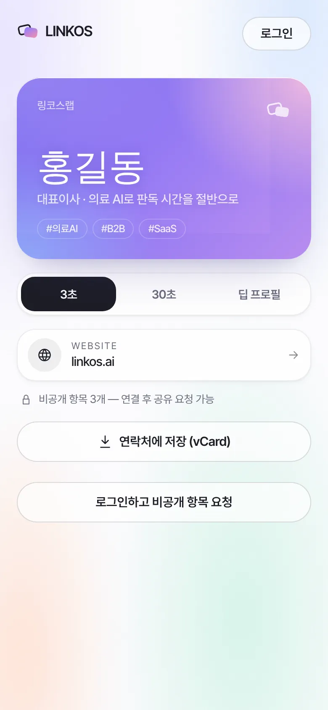 <b>공개 Living Card (public 항목만)</b> <a href="../apps/web/src/app/p/%5Bslug%5D/page.tsx"><code>page.tsx</code></a></td>
</tr>
</table>

## 데스크톱

### 랜딩 (데스크톱)
[`apps/web/src/app/page.tsx`](../apps/web/src/app/page.tsx)

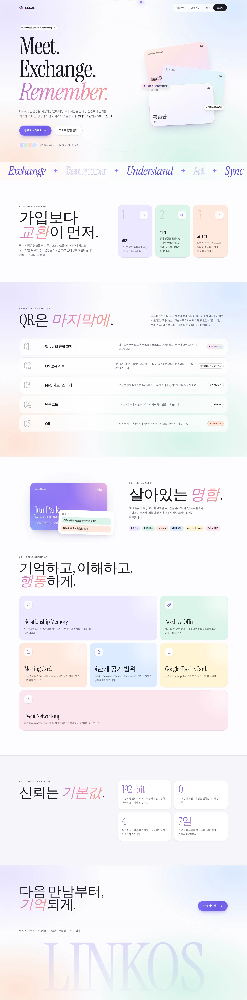

### 앱 홈 (데스크톱, 사이드 내비)
[`apps/web/src/components/Dock.tsx`](../apps/web/src/components/Dock.tsx)

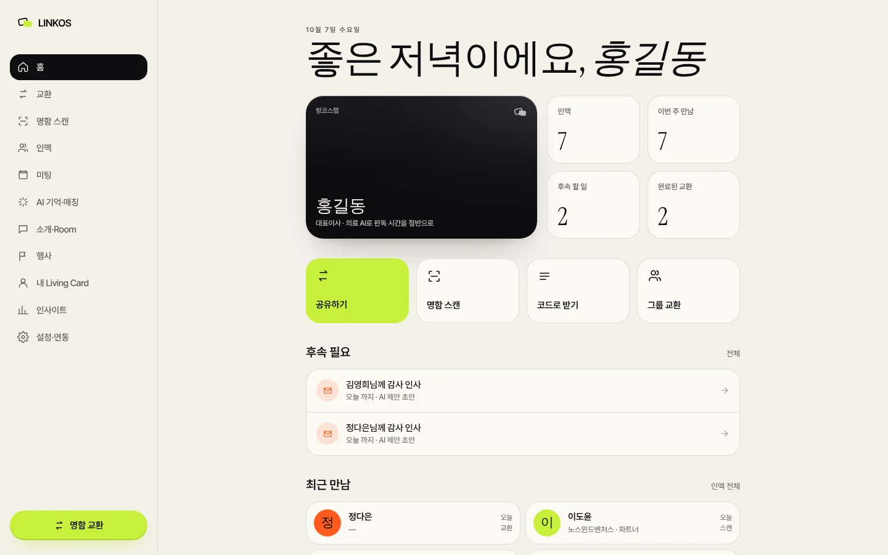

### 인맥 상세 (데스크톱)
[`apps/web/src/app/app/people/[id]/PersonDetail.tsx`](../apps/web/src/app/app/people/%5Bid%5D/PersonDetail.tsx)

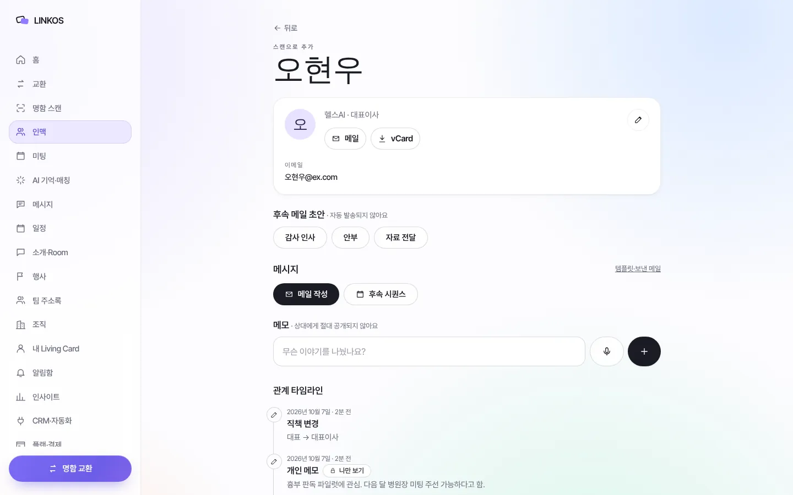

### 카드 편집 + 실시간 미리보기
[`apps/web/src/app/app/me/edit/CardEditor.tsx`](../apps/web/src/app/app/me/edit/CardEditor.tsx)

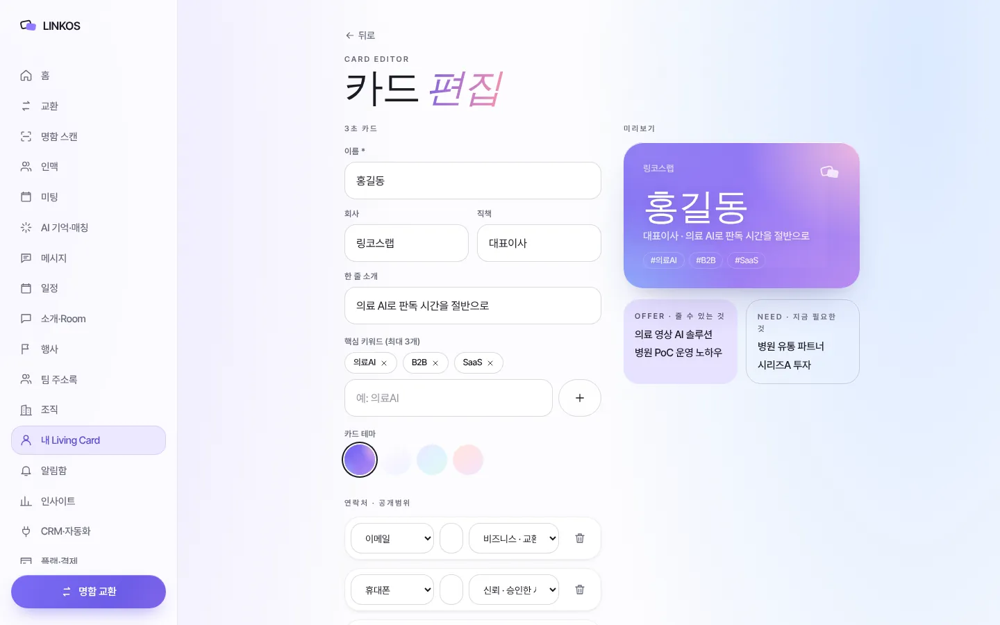

### 로그인 (데스크톱)
[`apps/web/src/app/login/LoginForm.tsx`](../apps/web/src/app/login/LoginForm.tsx)

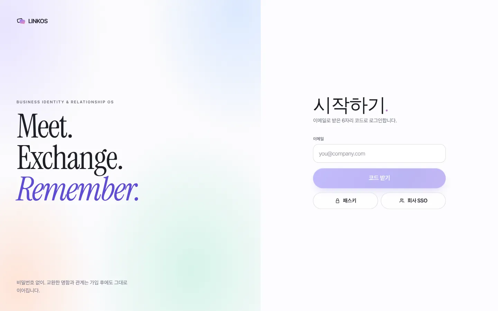
